# MAPTECH Project Management System
## Complete System Documentation

**Document Version:** 3.0  
**Last Updated:** March 31, 2026  
**Classification:** Internal Use Only  
**Document Owner:** MAPTECH IT Department

---

## Table of Contents

1. [Introduction](#1-introduction)
2. [Executive Summary](#2-executive-summary)
3. [System Overview](#3-system-overview)
4. [Features](#4-features)
5. [User Roles and Permissions](#5-user-roles-and-permissions)
6. [System Architecture](#6-system-architecture)
7. [Business Processes](#7-business-processes)
8. [Functional Requirements](#8-functional-requirements)
9. [Non-Functional Requirements](#9-non-functional-requirements)
10. [Data Architecture](#10-data-architecture)
11. [Modules](#11-modules)
12. [User Interface](#12-user-interface)
13. [API Design](#13-api-design)
14. [Security](#14-security)
15. [Integrations](#15-integrations)
16. [Testing](#16-testing)
17. [Deployment](#17-deployment)
18. [Operations](#18-operations)
19. [Maintenance](#19-maintenance)
20. [Risk Management](#20-risk-management)
21. [Future Enhancements](#21-future-enhancements)
22. [Appendices](#22-appendices)
23. [User Manual](#23-user-manual)

---

## 1. Introduction

### 1.1 Purpose

This document provides comprehensive technical and operational documentation for the **MAPTECH Project Management System (PMS)**. It serves as the authoritative reference for understanding system functionality, architecture, and usage.

### 1.2 Scope

The MAPTECH PMS is a web-based application that enables organizations to:
- Manage projects through their complete lifecycle
- Track tasks with progress, time logging, and completion workflows
- Handle budget requests with multi-stage approval processes
- Visualize project timelines using Gantt charts
- Maintain comprehensive audit trails for compliance
- Control access through role-based and department-based permissions

### 1.3 Definitions and Key Terms

| Term | Definition |
|------|------------|
| **Project** | A container for tasks, budgets, and team assignments with defined start/end dates and budget allocation |
| **Task** | A unit of work within a project, assigned to a user with progress tracking and time logging |
| **Blocker** | An issue preventing task completion that requires resolution |
| **Gantt Item** | A visual element (phase, step, subtask, or milestone) displayed on the project timeline |
| **Budget Request** | A formal request for funds, requiring accounting approval |
| **Audit Log** | An immutable record of system actions for compliance tracking |
| **Department** | Organizational unit determining user permissions (Admin, Technical, Accounting, Employee) |
| **Approval Workflow** | Multi-stage review process for projects or budget requests |
| **Form Submission** | Structured data entry for different project lifecycle stages |

### 1.4 Document Audience

| Audience | Relevant Sections |
|----------|-------------------|
| Executive Leadership | Sections 2, 3, 4, 20 |
| Project Managers | Sections 4, 7, 11, 23 |
| Developers | Sections 6, 10, 13, 14, 16 |
| System Administrators | Sections 17, 18, 19 |
| End Users | Section 23 (User Manual) |
| Compliance/Security | Sections 10.4, 14, 20 |

---

## 2. Executive Summary

### 2.1 Business Context

The MAPTECH Project Management System is an enterprise web application designed to centralize project execution, resource management, and financial tracking. It replaces fragmented spreadsheets and manual processes with an integrated, real-time platform accessible to all organizational roles.

### 2.2 System Capabilities

The system provides five core capability areas:

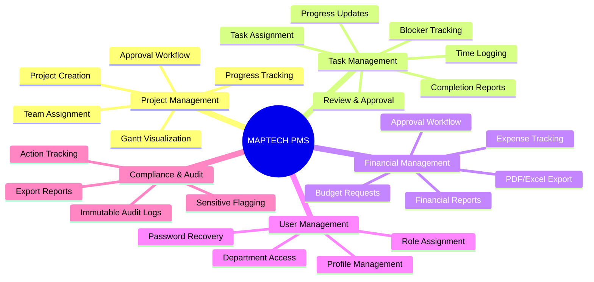

### 2.3 Key Business Benefits

| Benefit | Description |
|---------|-------------|
| **Centralized Visibility** | Single source of truth for all project data across departments |
| **Workflow Automation** | Multi-stage approvals with automatic notifications |
| **Financial Control** | Real-time budget tracking with approval gates |
| **Compliance Assurance** | Immutable audit trails for all significant actions |
| **Role-Based Access** | Granular permissions based on role and department |
| **Real-Time Updates** | Auto-refreshing data every 15 seconds |

### 2.4 Technology Stack

| Layer | Technology | Version |
|-------|------------|---------|
| Backend Framework | Laravel | 11.x |
| Backend Language | PHP | 8.2+ |
| Frontend Framework | React | 18.x |
| Build Tool | Vite | 5.x |
| CSS Framework | Tailwind CSS | 3.x |
| Database | MySQL / PostgreSQL | 8.0 / 15.x |
| Containerization | Docker | 24.x |

---

## 3. System Overview

### 3.1 High-Level Architecture

The MAPTECH PMS follows a **Single Page Application (SPA)** architecture with a Laravel API backend.

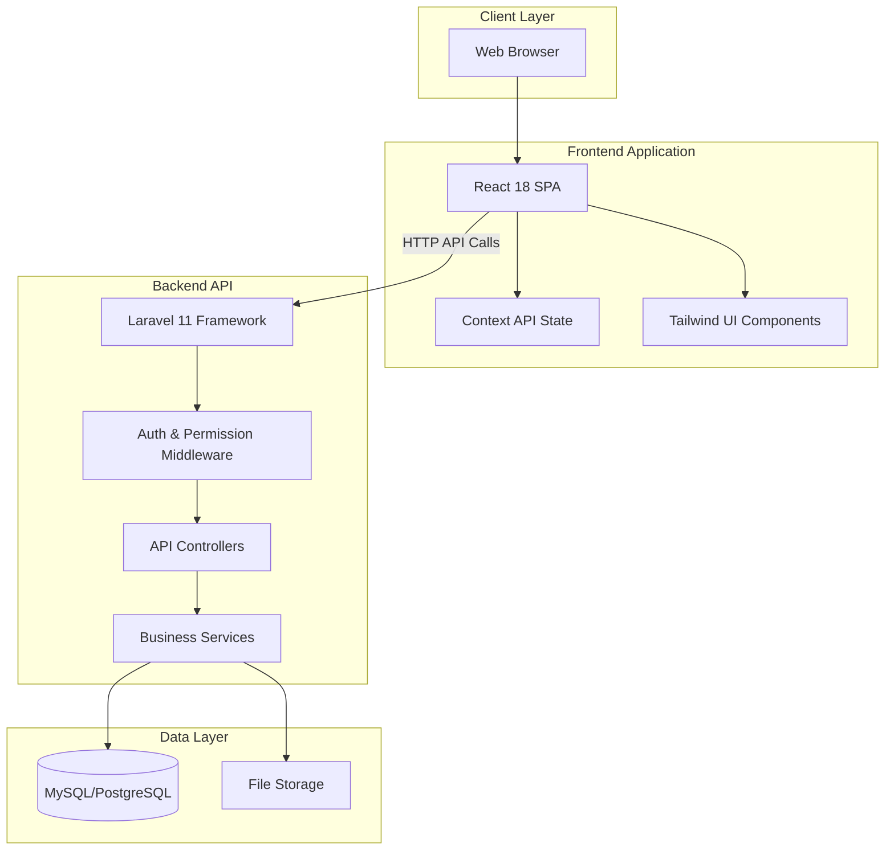

### 3.2 Application Architecture

The application consists of two main components:

**Backend (Laravel):**
- RESTful API endpoints for all operations
- Authentication via session cookies with CSRF protection
- Role and department-based middleware authorization
- Business logic encapsulated in service classes
- Eloquent ORM for database operations

**Frontend (React):**
- Standalone SPA mounted at application root
- Context API for global state management (Theme, Auth, Navigation, Data)
- Role-based page rendering (Admin vs Employee views)
- Real-time data refresh via polling (15-second intervals)
- LocalStorage persistence for offline resilience

### 3.3 Request Flow

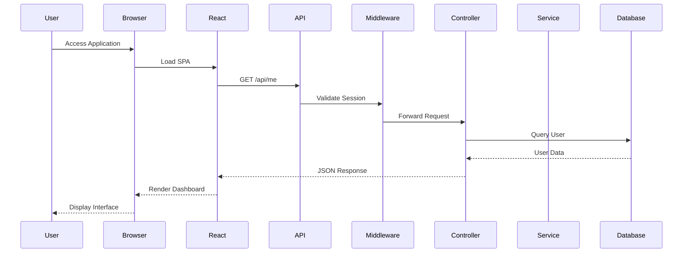

---

## 4. Features

### 4.1 Project Management

**Project** is the central organizational unit containing tasks, budgets, media, and team assignments.

| Feature | Description |
|---------|-------------|
| Project Creation | Create projects with name, description, dates, budget, and team |
| Serial Number | Auto-generated unique identifier (MAP-YYYY-XXXXXXXXXX format) |
| Team Assignment | Assign manager, project leader, and team members |
| Status Tracking | Track status: active, on-hold, completed, archived |
| Progress Monitoring | Visual progress percentage based on task completion |
| Budget Tracking | Monitor allocated budget vs. actual spending |

**Project Approval Workflow:**
Projects progress through a multi-stage approval process before becoming active:

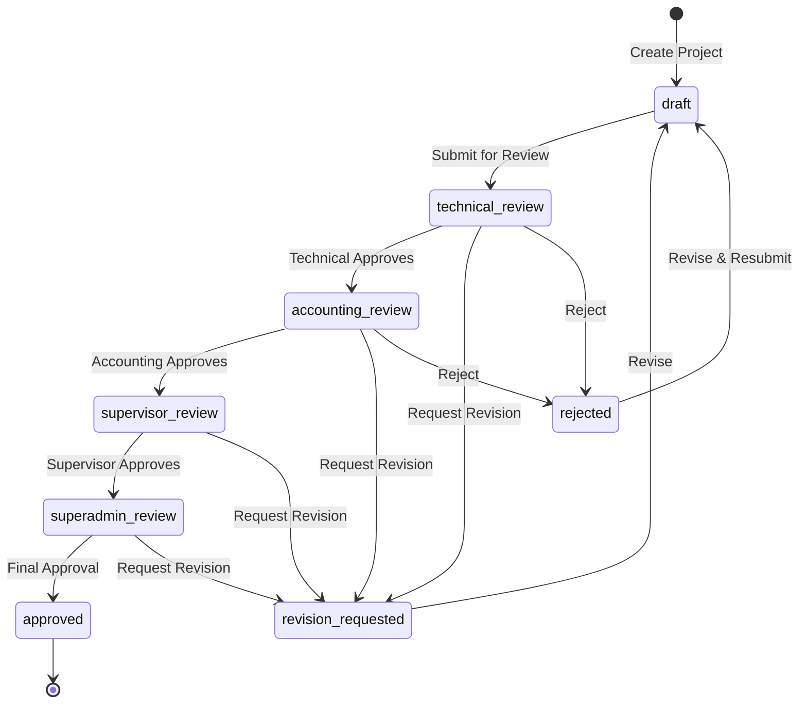

### 4.2 Task Management

**Tasks** are the units of work within projects, assigned to individual users.

| Feature | Description |
|---------|-------------|
| Task Creation | Create tasks with title, description, priority, dates, and estimated hours |
| Task Assignment | Assign to specific user with optional employee edit permission |
| Progress Updates | Track completion percentage with work description logs |
| Time Logging | Log hours worked with date and description |
| Completion Submission | Submit completion reports with deliverables and summary |
| Review & Approval | Manager review with approve/reject/revision workflow |
| Blocker Reporting | Report issues blocking task completion |

**Task Lifecycle:**

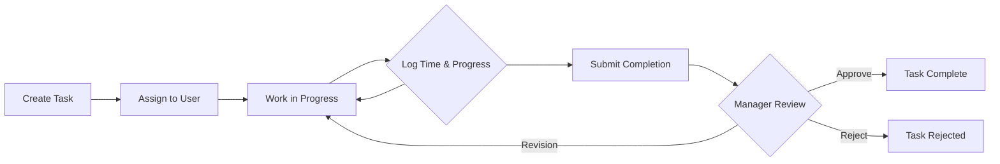

### 4.3 Gantt Chart Visualization

The **Gantt Chart** provides visual timeline representation of project items and their dependencies.

| Feature | Description |
|---------|-------------|
| Item Types | Phase, Step, Subtask, Milestone |
| Hierarchy | Parent-child relationships for nested items |
| Dependencies | Finish-to-start dependency tracking between items |
| Visibility Control | Restrict visibility by role or specific users |
| Progress Tracking | Visual progress bars for each item |

### 4.4 Budget Management

**Budget Requests** enable formal financial approval processes.

| Feature | Description |
|---------|-------------|
| Request Submission | Submit requests with amount, purpose, and type |
| Approval Workflow | Pending → Approved / Rejected / Revision Requested |
| Revision Tracking | Track original amount and revision count |
| Attachments | Support file attachments for documentation |
| Reporting | Generate budget reports with PDF/Excel export |

### 4.5 Media Management

**Media** provides file attachment capabilities for projects and tasks.

| Feature | Description |
|---------|-------------|
| File Upload | Upload documents, images, and other files |
| File Types | Support for file, video, and text content |
| Visibility Control | Restrict access to specific users |
| Download | Direct file download capability |

### 4.6 Issue Tracking

**Issues** track problems, risks, assumptions, and dependencies.

| Feature | Description |
|---------|-------------|
| Issue Types | Risk, Assumption, Issue, Dependency |
| Severity Levels | Low, Medium, High, Critical |
| Status Tracking | Open, In Progress, Resolved, Closed |
| Assignment | Assign to specific user for resolution |

### 4.7 Audit Logging

**Audit Logs** provide immutable records of all significant system actions.

| Feature | Description |
|---------|-------------|
| Immutable Records | Logs cannot be modified or deleted |
| Comprehensive Tracking | Captures action, user, resource, changes, context |
| Sensitive Flagging | Mark compliance-critical operations |
| Export | PDF and Excel export capabilities |

### 4.8 Project Forms

**Project Form Submissions** provide structured data entry for different project stages:

| Form Type | Purpose |
|-----------|---------|
| Project Details | Basic project information |
| Project Planning | Planning and scope documentation |
| Progress Update | Regular progress reporting |
| Issue/Risk | Problem and risk documentation |
| Approval Review | Review stage documentation |
| Completion Handover | Project completion and handover |
| Analytics/KPI | Key performance indicators |

---

## 5. User Roles and Permissions

### 5.1 Role Hierarchy

The system implements a two-dimensional access control model based on **Role** and **Department**.

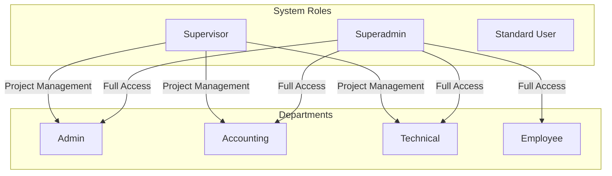

### 5.2 Role Definitions

| Role | Description | Key Capabilities |
|------|-------------|------------------|
| **Superadmin** | Highest privilege level with full system access | User management, audit logs, system settings, all operations |
| **Supervisor** | Project management authority | Create/edit/delete projects, elevated approval rights |
| **Standard User** | Regular user with department-based permissions | Permissions determined by department assignment |

### 5.3 Department Permissions

Each department has specific permission sets defined in the `Department` enum:

| Department | Permissions |
|------------|-------------|
| **Admin** | `*` (All permissions - wildcard access) |
| **Accounting** | `budget.view`, `budget.manage`, `budget-report.view`, `budget-report.export` |
| **Technical** | `gantt.view`, `gantt.manage`, `tasks.view`, `tasks.manage` |
| **Employee** | `tasks.view-own`, `tasks.update-own`, `budget.request` |

### 5.4 Permission Matrix

| Feature | Superadmin | Supervisor | Admin Dept | Technical Dept | Accounting Dept | Employee Dept |
|---------|------------|------------|------------|----------------|-----------------|---------------|
| **User Management** | ✓ | ✗ | ✗ | ✗ | ✗ | ✗ |
| **Audit Logs** | ✓ | ✗ | ✗ | ✗ | ✗ | ✗ |
| **Create Project** | ✓ | ✓ | ✗ | ✗ | ✗ | ✗ |
| **Edit Project** | ✓ | ✓ | ✗ | ✗ | ✗ | ✗ |
| **Delete Project** | ✓ | ✓ | ✗ | ✗ | ✗ | ✗ |
| **View All Projects** | ✓ | ✓ | ✓ | ✓ | ✓ | Filtered |
| **Create Task** | ✓ | ✓ | ✓ | ✓ | ✗ | ✗ |
| **Edit Task** | ✓ | ✓ | ✓ | ✓ | ✗ | Assigned Only* |
| **Delete Task** | ✓ | ✗ | ✗ | ✗ | ✗ | ✗ |
| **Manage Gantt** | ✓ | ✓ | ✓ | ✓ | ✗ | ✗ |
| **Submit Budget** | ✓ | ✓ | ✓ | ✓ | ✓ | ✓ |
| **Approve Budget** | ✓ | ✓ | ✓ | ✗ | ✓ | ✗ |
| **Budget Reports** | ✓ | ✓ | ✓ | ✗ | ✓ | ✗ |
| **Review Forms** | ✓ | ✓ | ✓ | ✓ | ✓ | ✗ |
| **Log Time** | ✓ | ✓ | ✓ | ✓ | ✗ | ✓ |
| **Submit Completion** | ✓ | ✓ | ✓ | ✓ | ✗ | ✓ |
| **Review Tasks** | ✓ | ✓ | ✓ | ✓ | ✓ | ✗ |

*Employees can only edit assigned tasks when `allow_employee_edit` is enabled on the task.

### 5.5 Access Control Implementation

Access control is implemented through three middleware layers:

1. **`auth.api`** - Validates user is authenticated and account is active
2. **`role:{roles}`** - Validates user has required role (superadmin/supervisor)
3. **`department:{departments}`** - Validates user belongs to required department

**Bypass Rules:**
- Superadmin and Admin roles bypass all department checks
- Superadmin bypasses all role checks

---

## 6. System Architecture

### 6.1 Directory Structure

```
project-app/
├── app/
│   ├── Console/                    # Artisan CLI commands
│   ├── Enums/
│   │   └── Department.php          # Department enum with permissions
│   ├── Http/
│   │   ├── Controllers/
│   │   │   └── Api/                # API controllers (18 controllers)
│   │   └── Middleware/             # Custom middleware (4 files)
│   ├── Models/                     # Eloquent models (19 models)
│   ├── Notifications/              # Laravel notifications
│   ├── Providers/                  # Service providers
│   └── Services/                   # Business logic services (5 services)
├── bootstrap/
│   └── app.php                     # Middleware registration
├── config/                         # Configuration files
├── database/
│   ├── factories/                  # Model factories
│   ├── migrations/                 # Database migrations (42 files)
│   └── seeders/                    # Database seeders
├── public/                         # Public assets
├── resources/
│   ├── js/
│   │   ├── project-management/     # React SPA source
│   │   │   ├── App.tsx             # Main app component
│   │   │   ├── context/            # State management contexts
│   │   │   ├── components/         # Reusable components
│   │   │   ├── pages/              # Page components
│   │   │   └── data/               # Mock data & types
│   │   └── bootstrap.js            # Axios/Echo setup
│   └── views/                      # Blade templates
├── routes/
│   ├── web.php                     # All routes (API + SPA)
│   └── auth.php                    # Laravel Breeze auth routes
├── storage/                        # File storage
└── tests/                          # Test suites
```

### 6.2 Backend Architecture

#### 6.2.1 Controllers

| Controller | Purpose | Key Methods |
|------------|---------|-------------|
| `AuthController` | Authentication | login, logout, me, changePassword, verifyRecovery, resetPasswordOffline |
| `UserController` | User management | index, store, update, destroy, uploadPhoto, regenerateRecovery |
| `ProjectController` | Project CRUD | index, store, update, destroy |
| `ProjectApprovalController` | Approval workflow | transition, history |
| `TaskController` | Task CRUD | index, store, update, destroy |
| `TaskProgressLogController` | Progress tracking | show, update |
| `TaskTimeLogController` | Time logging | index, store, update, destroy |
| `TaskCompletionController` | Completion workflow | index, store, update |
| `TaskReviewController` | Review workflow | index, store, update |
| `TaskBlockerController` | Blocker management | index, store, update, destroy |
| `TaskActivityController` | Activity timeline | index |
| `BudgetRequestController` | Budget management | index, store, update, destroy, report, exportPdf, exportSheet |
| `GanttController` | Gantt chart | index, store, update, destroy, move, indexDependencies, storeDependency, destroyDependency |
| `MediaController` | File management | index, store, destroy, download, serve |
| `IssueController` | Issue tracking | index, store, update, destroy |
| `ProjectFormController` | Form submissions | index, store, update |
| `AuditLogController` | Audit viewing | index, indexForProject, exportPdf, exportSheet |
| `SystemSettingsController` | System config | getAuditLogRetention, updateAuditLogRetention |

#### 6.2.2 Services

| Service | Purpose | Key Responsibilities |
|---------|---------|----------------------|
| `AuditService` | Audit logging | 42+ event types, immutable logging, sensitive flagging |
| `ProjectApprovalService` | Approval workflow | Multi-stage transitions, permission validation, budget recalculation |
| `ProjectSerialService` | Serial generation | Unique serial creation with concurrency safety |
| `GanttVisibilityService` | Gantt permissions | Role and assignment-based visibility checks |
| `TaskActivityLogger` | Task activity | Human-readable activity descriptions for UI timeline |

#### 6.2.3 Middleware

| Middleware | Alias | Purpose |
|------------|-------|---------|
| `EnsureApiAuthenticated` | `auth.api` | Validate session, check account status |
| `EnsureRole` | `role` | Validate user has required role |
| `EnsureDepartment` | `department` | Validate user in allowed department |
| `HandleInertiaRequests` | - | Inertia.js SSR integration |

### 6.3 Frontend Architecture

#### 6.3.1 State Management

The frontend uses React Context API with four separate contexts:

```mermaid
graph TB
    subgraph "AppProvider"
        Theme[ThemeContext]
        Auth[AuthContext]
        Nav[NavigationContext]
        Data[DataContext]
    end
    
    subgraph "ThemeContext"
        isDark[isDark: boolean]
        toggleTheme[toggleTheme()]
    end
    
    subgraph "AuthContext"
        currentUser[currentUser: User]
        login[login()]
        logout[logout()]
    end
    
    subgraph "NavigationContext"
        currentPage[currentPage: string]
        setCurrentPage[setCurrentPage()]
    end
    
    subgraph "DataContext"
        collections[projects, tasks, users, budgetRequests, issues, media, timeLogs, ganttItems, formSubmissions]
        refresh[refreshAll()]
    end
    
    Theme --> isDark
    Theme --> toggleTheme
    Auth --> currentUser
    Auth --> login
    Auth --> logout
    Nav --> currentPage
    Nav --> setCurrentPage
    Data --> collections
    Data --> refresh
```

#### 6.3.2 Page Components

**Admin/Elevated Role Pages:**
- AdminDashboard - Statistics overview
- ProjectsPage - Project management
- GanttPage - Gantt chart editing
- CreateProjectPage - Project creation wizard
- MonitorControlPage - Project monitoring
- BudgetApprovalsPage - Budget approval workflow
- BudgetReportPage - Financial reporting
- TeamManagementPage - User management
- ReportsMediaPage - Media management
- TaskReviewsPage - Task review workflow
- AuditLogPage - Audit log viewing
- ArchivePage - Archived items

**Employee Pages:**
- EmployeeDashboard - Personal dashboard
- MyTasksPage - Assigned task management
- ViewGanttPage - Read-only Gantt view
- BudgetRequestPage - Budget request submission
- LogTimePage - Time logging
- ReportIssuePage - Issue reporting
- ResourcesPage - Resource access

#### 6.3.3 Component Hierarchy

```
App.tsx
├── AppProvider (context wrapper)
│   ├── LoginPage / ForgotPasswordPage (unauthenticated)
│   └── AppLayout (authenticated)
│       ├── Header
│       │   ├── Notifications
│       │   ├── ThemeToggle
│       │   └── UserMenu
│       ├── Sidebar (department-aware navigation)
│       └── Content Area
│           └── Page Component (role-based)
│               ├── ProjectFormsPanel
│               ├── GanttItemForm
│               ├── Modal Components
│               └── UI Components
```

---

## 7. Business Processes

### 7.1 Project Lifecycle Process

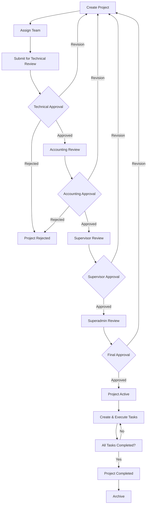

### 7.2 Task Execution Process

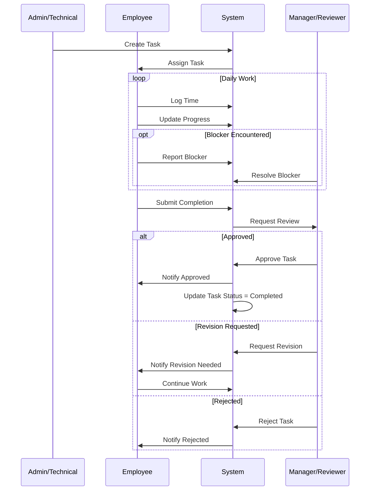

### 7.3 Budget Request Process

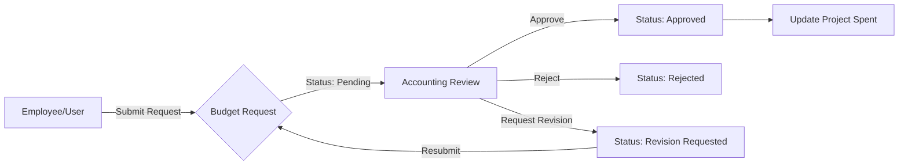

### 7.4 Gantt Item Visibility Process

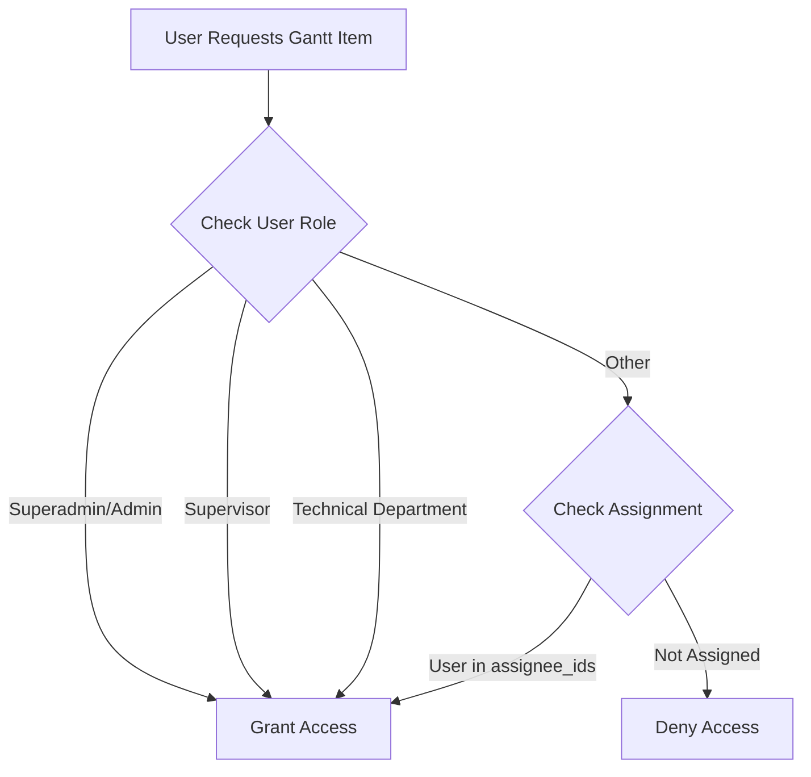

---

## 8. Functional Requirements

### 8.1 Authentication Requirements

| ID | Requirement | Implementation |
|----|-------------|----------------|
| FR-AUTH-01 | Users must authenticate with email and password | `AuthController::login()` with session |
| FR-AUTH-02 | System must support password recovery via recovery code | `AuthController::verifyRecovery()` + `resetPasswordOffline()` |
| FR-AUTH-03 | First-time users must change initial password | `must_change_password` flag with `ChangePasswordModal` |
| FR-AUTH-04 | Deactivated accounts cannot access system | `EnsureApiAuthenticated` checks status |
| FR-AUTH-05 | Sessions must be invalidated on logout | `Auth::guard('web')->logout()` |

### 8.2 Project Management Requirements

| ID | Requirement | Implementation |
|----|-------------|----------------|
| FR-PROJ-01 | Only Supervisor/Superadmin can create projects | `role:supervisor` middleware |
| FR-PROJ-02 | Projects must have unique serial numbers | `ProjectSerialService` with concurrency locks |
| FR-PROJ-03 | Projects must track budget vs spent | `budget` and `spent` fields with auto-calculation |
| FR-PROJ-04 | Projects must support multi-stage approval | `ProjectApprovalService` state machine |
| FR-PROJ-05 | All tasks must be 100% complete before project submission | Validated in `ProjectApprovalService::submit_for_review` |

### 8.3 Task Management Requirements

| ID | Requirement | Implementation |
|----|-------------|----------------|
| FR-TASK-01 | Only Admin/Technical can create tasks | `department:Admin,Technical` middleware |
| FR-TASK-02 | Tasks must track progress percentage | `TaskProgressLog` with history |
| FR-TASK-03 | Users can log time against tasks | `TaskTimeLog` with auto-aggregation to `logged_hours` |
| FR-TASK-04 | Tasks support completion submission workflow | `TaskCompletion` + `TaskReview` models |
| FR-TASK-05 | Blockers can be reported and resolved | `TaskBlocker` with resolved_at tracking |

### 8.4 Budget Requirements

| ID | Requirement | Implementation |
|----|-------------|----------------|
| FR-BUD-01 | All authenticated users can submit budget requests | Open route with `auth.api` middleware |
| FR-BUD-02 | Only Accounting/Admin can approve requests | `department:Accounting` middleware |
| FR-BUD-03 | Budget reports can be exported as PDF/Excel | `BudgetRequestController::exportPdf/exportSheet` |
| FR-BUD-04 | Revision requests preserve original amount | `original_amount` and `revision_count` fields |

### 8.5 Audit Requirements

| ID | Requirement | Implementation |
|----|-------------|----------------|
| FR-AUD-01 | All significant actions must be logged | `AuditService` with 42+ event types |
| FR-AUD-02 | Audit logs must be immutable | `AuditLog` model prevents update/delete |
| FR-AUD-03 | Only Superadmin can view audit logs | `role:superadmin` middleware |
| FR-AUD-04 | Audit logs must capture user, action, changes, context | Schema includes all required fields |

---

## 9. Non-Functional Requirements

### 9.1 Performance Requirements

| ID | Requirement | Target |
|----|-------------|--------|
| NFR-PERF-01 | Initial page load time | < 3 seconds |
| NFR-PERF-02 | API response time (95th percentile) | < 500ms |
| NFR-PERF-03 | Real-time data refresh interval | 15 seconds |
| NFR-PERF-04 | Concurrent user support | 100+ users |

### 9.2 Availability Requirements

| ID | Requirement | Target |
|----|-------------|--------|
| NFR-AVAIL-01 | System uptime | 99.5% |
| NFR-AVAIL-02 | Recovery Time Objective (RTO) | < 4 hours |
| NFR-AVAIL-03 | Recovery Point Objective (RPO) | < 1 hour |

### 9.3 Security Requirements

| ID | Requirement | Implementation |
|----|-------------|----------------|
| NFR-SEC-01 | All traffic must be encrypted | HTTPS required |
| NFR-SEC-02 | Passwords must be securely hashed | Laravel bcrypt (automatic via cast) |
| NFR-SEC-03 | CSRF protection for state-changing requests | Laravel CSRF tokens |
| NFR-SEC-04 | SQL injection prevention | Eloquent ORM parameterized queries |
| NFR-SEC-05 | Session security | HTTP-only, secure cookies |

### 9.4 Scalability Requirements

| ID | Requirement | Strategy |
|----|-------------|----------|
| NFR-SCALE-01 | Horizontal application scaling | Stateless design, session in database |
| NFR-SCALE-02 | Database scaling | Read replicas supported |
| NFR-SCALE-03 | File storage scaling | External storage support |

### 9.5 Maintainability Requirements

| ID | Requirement | Implementation |
|----|-------------|----------------|
| NFR-MAINT-01 | Database schema versioning | Laravel migrations |
| NFR-MAINT-02 | Dependency management | Composer (PHP), npm (JS) |
| NFR-MAINT-03 | Configuration externalization | `.env` file with `config()` |
| NFR-MAINT-04 | Code organization | MVC pattern, service layer |

---

## 10. Data Architecture

### 10.1 Entity Relationship Diagram

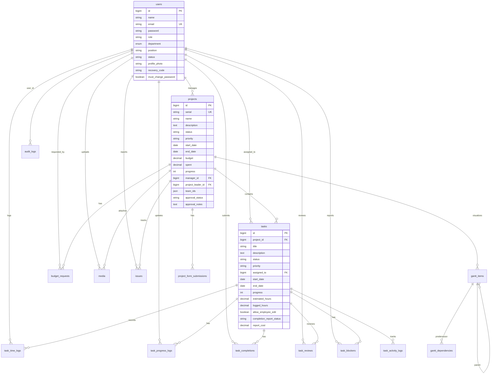

### 10.2 Core Tables

| Table | Description | Key Fields |
|-------|-------------|------------|
| `users` | User accounts | name, email, role, department, status |
| `projects` | Project records | serial, name, budget, spent, approval_status |
| `tasks` | Task records | project_id, title, status, progress, assigned_to |
| `budget_requests` | Budget requests | project_id, amount, status, type, purpose |
| `gantt_items` | Gantt chart items | project_id, type, name, start_date, end_date |
| `gantt_dependencies` | Item dependencies | predecessor_id, successor_id, type |
| `audit_logs` | Immutable audit trail | action, resource_type, resource_id, changes |

### 10.3 Task-Related Tables

| Table | Purpose | Key Fields |
|-------|---------|------------|
| `task_progress_logs` | Progress history | task_id, percentage_completed, work_description |
| `task_time_logs` | Time entries | task_id, date_worked, hours_worked |
| `task_completions` | Completion submissions | task_id, completion_date, summary, deliverable_path |
| `task_reviews` | Review records | task_id, reviewer_id, approval_status, comments |
| `task_blockers` | Blocker tracking | task_id, issue_title, priority, resolved_at |
| `task_activity_logs` | Activity timeline | task_id, action_type, description, metadata |

### 10.4 Audit Log Schema

The audit log table is designed for immutable compliance tracking:

```sql
CREATE TABLE audit_logs (
    id BIGINT PRIMARY KEY,
    user_id BIGINT,                    -- Who performed the action
    actor_role VARCHAR(50),            -- Role at time of action
    action VARCHAR(100),               -- Action type (e.g., project.approval)
    resource_type VARCHAR(100),        -- Affected resource type
    resource_id BIGINT,                -- Affected resource ID
    project_id BIGINT,                 -- Associated project (if any)
    changes JSON,                      -- Old/new value pairs
    snapshot JSON,                     -- Full resource state
    context JSON,                      -- Additional metadata
    ip_address VARCHAR(45),            -- Client IP
    user_agent TEXT,                   -- Browser info
    request_id VARCHAR(36),            -- Request correlation ID
    performed_via VARCHAR(20),         -- web/cli/api/system
    sensitive_flag BOOLEAN,            -- Compliance flag
    created_at TIMESTAMP               -- Immutable timestamp
);
```

**Immutability Enforcement:**
- Model prevents UPDATE and DELETE operations
- Only INSERT operations allowed
- No `updated_at` column

### 10.5 Data Types

| Type | Usage | Examples |
|------|-------|----------|
| `bigint` | Primary/foreign keys | id, user_id, project_id |
| `decimal(12,2)` | Financial amounts | budget, spent, amount |
| `decimal(8,2)` | Hours | estimated_hours, logged_hours |
| `json` | Flexible arrays | team_ids, assignee_ids, changes |
| `enum` | Constrained values | status, priority, type |
| `boolean` | Flags | allow_employee_edit, sensitive_flag |

---

## 11. Modules

### 11.1 Authentication Module

**Purpose:** User authentication, session management, and password recovery

**Components:**
- `AuthController` - Login/logout endpoints
- `EnsureApiAuthenticated` middleware
- `ChangePasswordModal` - Forced password change UI

**Key Flows:**
1. Login → Session creation → Token validation
2. Password recovery → Recovery code verification → Password reset
3. First login → Forced password change → Session continuation

### 11.2 User Management Module

**Purpose:** User CRUD operations and profile management

**Components:**
- `UserController` - User management endpoints
- `User` model - User data model with role/department
- `TeamManagementPage` - User management UI

**Key Features:**
- Create users with role and department assignment
- Generate recovery codes for password reset
- Profile photo upload and management
- Account activation/deactivation

### 11.3 Project Module

**Purpose:** Project lifecycle management

**Components:**
- `ProjectController` - Project CRUD
- `ProjectApprovalController` - Approval workflow
- `ProjectApprovalService` - Approval business logic
- `ProjectSerialService` - Serial number generation
- `Project` model - Project data model

**Key Features:**
- Project creation with team assignment
- Multi-stage approval workflow
- Serial number auto-generation
- Budget tracking

### 11.4 Task Module

**Purpose:** Task management with full lifecycle support

**Components:**
- `TaskController` - Task CRUD
- `TaskProgressLogController` - Progress tracking
- `TaskTimeLogController` - Time logging
- `TaskCompletionController` - Completion workflow
- `TaskReviewController` - Review workflow
- `TaskBlockerController` - Blocker management
- `TaskActivityController` - Activity timeline
- `TaskActivityLogger` - Activity logging service

**Key Features:**
- Task assignment with employee edit control
- Progress tracking with history
- Time logging with aggregation
- Completion submission and review
- Blocker reporting and resolution
- Activity timeline for audit

### 11.5 Gantt Module

**Purpose:** Visual project timeline management

**Components:**
- `GanttController` - Gantt CRUD + dependencies
- `GanttVisibilityService` - Access control
- `GanttItem` model - Timeline items
- `GanttDependency` model - Item dependencies

**Key Features:**
- Hierarchical items (phase → step → subtask)
- Dependency tracking (finish-to-start)
- Role and user-based visibility
- Progress visualization

### 11.6 Budget Module

**Purpose:** Financial management and reporting

**Components:**
- `BudgetRequestController` - Request management + reporting
- `BudgetRequest` model - Request data model

**Key Features:**
- Request submission with attachments
- Approval workflow (pending → approved/rejected)
- Revision tracking
- PDF/Excel report export

### 11.7 Media Module

**Purpose:** File attachment management

**Components:**
- `MediaController` - File CRUD
- `Media` model - File metadata storage

**Key Features:**
- File upload (document, video, text)
- Visibility control per file
- Download and inline serving

### 11.8 Audit Module

**Purpose:** Compliance and audit trail

**Components:**
- `AuditLogController` - Log viewing and export
- `AuditService` - Centralized logging service
- `AuditLog` model - Immutable log storage

**Key Features:**
- 42+ event types tracked
- Immutable record storage
- Sensitive operation flagging
- PDF/Excel export

### 11.9 Project Forms Module

**Purpose:** Structured data entry for project stages

**Components:**
- `ProjectFormController` - Form submission management
- `ProjectFormSubmission` model - Form data storage
- Form components (7 form types)

**Key Features:**
- 7 form types (details, planning, progress, issues, approval, completion, KPI)
- Submission and review workflow
- Status tracking (submitted → reviewed → approved/rejected)

---

## 12. User Interface

### 12.1 UI Architecture

The frontend is a React SPA with role-based page rendering:

```mermaid
graph TB
    subgraph "Layout"
        App[App.tsx]
        Layout[AppLayout]
        Header[Header]
        Sidebar[Sidebar]
        Content[Content Area]
    end
    
    subgraph "Admin Views"
        AdminDash[Admin Dashboard]
        Projects[Projects Page]
        Gantt[Gantt Page]
        Budget[Budget Pages]
        Audit[Audit Log Page]
    end
    
    subgraph "Employee Views"
        EmpDash[Employee Dashboard]
        Tasks[My Tasks Page]
        TimeLog[Log Time Page]
        BudgetReq[Budget Request]
    end
    
    App --> Layout
    Layout --> Header
    Layout --> Sidebar
    Layout --> Content
    Content -->|Admin/Technical/Accounting| AdminDash
    Content -->|Admin/Technical/Accounting| Projects
    Content -->|Admin/Technical/Accounting| Gantt
    Content -->|Accounting/Admin| Budget
    Content -->|Superadmin| Audit
    Content -->|Employee| EmpDash
    Content -->|Employee| Tasks
    Content -->|Employee| TimeLog
    Content -->|Employee| BudgetReq
```

### 12.2 Navigation Structure

**Admin/Technical/Accounting Users:**
```
📊 Dashboard
├── Statistics Overview
├── Recent Projects
└── Task Summary

📁 Projects
├── Project List
├── Create Project
└── Project Detail
    ├── Forms Panel
    ├── Tasks
    └── Gantt Chart

📋 Gantt Charts
├── Interactive Timeline
├── Dependencies
└── Item Management

💰 Budget (Accounting)
├── Budget Requests
├── Approvals
└── Reports

👥 Team Management (Superadmin)
├── User List
├── Create User
└── User Settings

📜 Audit Logs (Superadmin)
├── Log Viewer
├── Filters
└── Export
```

**Employee Users:**
```
📊 My Dashboard
├── Personal Statistics
├── Assigned Tasks
└── Notifications

✅ My Tasks
├── Task List
├── Task Detail
│   ├── Progress Update
│   ├── Time Log
│   ├── Submit Completion
│   └── Report Blocker

📈 View Gantt (Read-Only)

💰 Budget Requests
├── My Requests
└── Submit Request

⏱️ Log Time
📝 Report Issue
📁 Resources
```

### 12.3 Key UI Components

| Component | Purpose |
|-----------|---------|
| `AppLayout` | Main layout with sidebar, header, and content area |
| `Header` | Top bar with notifications, theme toggle, user menu |
| `Sidebar` | Navigation menu (department-aware) |
| `ProjectFormsPanel` | Multi-form project management with 7 form types |
| `GanttItemForm` | Create/edit Gantt items with visibility settings |
| `Modal` | Reusable modal dialog wrapper |
| `Badge` | Status and priority indicators |
| `ProgressBar` | Visual progress display |
| `UserAvatar` | User profile photos |

### 12.4 Theme Support

The application supports light and dark themes:
- Theme preference stored in localStorage (`maptech-theme`)
- Toggle available in header
- Tailwind CSS dark mode classes

### 12.5 Data Refresh

- Automatic refresh every 15 seconds (when tab is visible)
- Manual refresh available via UI buttons
- LocalStorage caching for offline resilience

---

## 13. API Design

### 13.1 API Overview

| Aspect | Specification |
|--------|---------------|
| Base URL | `/api` |
| Protocol | HTTPS |
| Format | JSON |
| Authentication | Session cookies |
| CSRF Protection | Token in header (`X-CSRF-TOKEN`) |

### 13.2 Authentication Endpoints

```
POST   /api/login                          # User login
POST   /api/verify-recovery                # Verify recovery code
POST   /api/reset-password-offline         # Reset password with recovery code
GET    /api/me                             # Get current user (session validation)
POST   /api/change-password                # Change user password
```

### 13.3 User Management Endpoints (Superadmin Only)

```
GET    /api/users                          # List all users
POST   /api/users                          # Create user
PUT    /api/users/{id}                     # Update user
DELETE /api/users/{id}                     # Delete user
POST   /api/users/{id}/regenerate-recovery # Regenerate recovery code
POST   /api/users/{id}/profile-photo       # Upload profile photo
GET    /api/users/{id}/photo               # Get profile photo
```

### 13.4 Project Endpoints

```
GET    /api/projects                       # List projects (filtered by department)
POST   /api/projects                       # Create project (Supervisor+)
PUT    /api/projects/{id}                  # Update project (Supervisor+)
DELETE /api/projects/{id}                  # Delete project (Supervisor+)
POST   /api/projects/{id}/approval         # Transition approval state
GET    /api/projects/{id}/approval-history # Get approval history
GET    /api/projects/{id}/audit-logs       # Get project audit logs
```

### 13.5 Task Endpoints

```
GET    /api/tasks                          # List tasks (filtered)
POST   /api/tasks                          # Create task (Admin/Technical)
PUT    /api/tasks/{id}                     # Update task
DELETE /api/tasks/{id}                     # Delete task (Superadmin only)

# Progress
PATCH  /api/tasks/{id}/progress            # Update progress
GET    /api/tasks/{id}/progress            # Get progress history

# Time Logs
GET    /api/tasks/{id}/time-logs           # List time logs
POST   /api/tasks/{id}/time-logs           # Create time log
PUT    /api/tasks/{id}/time-logs/{log}     # Update time log
DELETE /api/tasks/{id}/time-logs/{log}     # Delete time log

# Completions
GET    /api/tasks/{id}/completions         # List completions
POST   /api/tasks/{id}/completions         # Submit completion
PUT    /api/tasks/{id}/completions/{c}     # Update completion

# Reviews
GET    /api/tasks/{id}/reviews             # List reviews
POST   /api/tasks/{id}/reviews             # Submit review
PUT    /api/tasks/{id}/reviews/{r}         # Update review

# Blockers
GET    /api/tasks/{id}/blockers            # List blockers
POST   /api/tasks/{id}/blockers            # Report blocker
PUT    /api/tasks/{id}/blockers/{b}        # Update/resolve blocker
DELETE /api/tasks/{id}/blockers/{b}        # Delete blocker

# Activity
GET    /api/tasks/{id}/activities          # Get activity timeline
```

### 13.6 Gantt Endpoints

```
GET    /api/projects/{id}/gantt-items          # List Gantt items
POST   /api/projects/{id}/gantt-items          # Create item (Admin/Technical)
PUT    /api/projects/{id}/gantt-items/{item}   # Update item
DELETE /api/projects/{id}/gantt-items/{item}   # Delete item
PATCH  /api/projects/{id}/gantt-items/{item}/move  # Move item (reorder)

GET    /api/projects/{id}/gantt-dependencies       # List dependencies
POST   /api/projects/{id}/gantt-dependencies       # Create dependency
DELETE /api/projects/{id}/gantt-dependencies/{dep} # Delete dependency
```

### 13.7 Budget Endpoints

```
GET    /api/budget-requests                # List requests
POST   /api/budget-requests                # Create request
PUT    /api/budget-requests/{id}           # Update/approve (Accounting)
DELETE /api/budget-requests/{id}           # Delete request (Accounting)
GET    /api/budget-report                  # Generate report (Accounting)
GET    /api/budget-report/export-pdf       # Export PDF (Accounting)
GET    /api/budget-report/export-sheet     # Export Excel (Accounting)
```

### 13.8 Media Endpoints

```
GET    /api/media                          # List media
POST   /api/media                          # Upload file
DELETE /api/media/{id}                     # Delete file
GET    /api/media/{id}/download            # Download file
GET    /api/media/{id}/serve               # Serve file inline
```

### 13.9 Audit Log Endpoints (Superadmin Only)

```
GET    /api/audit-logs                     # List audit logs
GET    /api/audit-logs/export-pdf          # Export PDF
GET    /api/audit-logs/export-sheet        # Export Excel
```

### 13.10 Response Format

**Success Response:**
```json
{
    "message": "Operation successful",
    "data": { ... }
}
```

**Error Response:**
```json
{
    "message": "Validation failed",
    "errors": {
        "field": ["Error message"]
    }
}
```

**HTTP Status Codes:**
| Code | Meaning |
|------|---------|
| 200 | OK - Successful GET, PUT, PATCH |
| 201 | Created - Successful POST |
| 204 | No Content - Successful DELETE |
| 401 | Unauthorized - Authentication required |
| 403 | Forbidden - Insufficient permissions |
| 404 | Not Found - Resource doesn't exist |
| 422 | Unprocessable Entity - Validation errors |

---

## 14. Security

### 14.1 Authentication Security

| Measure | Implementation |
|---------|----------------|
| Password Hashing | Laravel bcrypt (automatic via `hashed` cast) |
| Session Management | Server-side sessions with database storage |
| Token Protection | CSRF tokens for state-changing requests |
| Account Lockout | Inactive accounts blocked at middleware level |
| Recovery Codes | Single-use codes for password reset |

### 14.2 Authorization Security

| Level | Implementation |
|-------|----------------|
| Route Level | Middleware (`auth.api`, `role`, `department`) |
| Controller Level | Manual permission checks |
| Service Level | Business logic validation |
| Data Level | Query scopes filtering by user access |

### 14.3 Middleware Protection

```php
// Route protection examples
Route::middleware('role:superadmin')      // Superadmin only
Route::middleware('role:supervisor')       // Supervisor or higher
Route::middleware('department:Accounting') // Accounting or Admin
Route::middleware('department:Admin,Technical,Accounting') // Multiple departments
```

### 14.4 Data Protection

| Data | Protection |
|------|------------|
| Passwords | Bcrypt hashing, never stored plain |
| Recovery Codes | Hidden in API responses |
| Sensitive Fields | Excluded from JSON serialization |
| Audit Logs | Immutable, sensitive operations flagged |

### 14.5 Request Security

| Protection | Implementation |
|------------|----------------|
| CSRF | Laravel CSRF tokens (excluded for API prefix) |
| XSS | React auto-escaping, CSP headers |
| SQL Injection | Eloquent ORM parameterized queries |
| Session Hijacking | HTTP-only secure cookies |

### 14.6 Sensitive Operations

The following operations are flagged as sensitive in audit logs:
- Project approval/rejection
- Budget request approval/rejection
- Task completion/review submissions
- User account changes
- Form reviews

---

## 15. Integrations

### 15.1 Current Integrations

| Integration | Purpose | Status |
|-------------|---------|--------|
| Laravel Echo | WebSocket support | Configured |
| File Storage | Local/S3-compatible | Supported |
| PDF Export | Report generation | Implemented |
| Excel Export | Data export | Implemented |

### 15.2 WebSocket Configuration

```javascript
// bootstrap.js
window.Echo = new Echo({
    broadcaster: 'reverb',
    key: import.meta.env.VITE_REVERB_APP_KEY,
    wsHost: import.meta.env.VITE_REVERB_HOST,
    wsPort: import.meta.env.VITE_REVERB_PORT,
    wssPort: import.meta.env.VITE_REVERB_PORT,
    forceTLS: (import.meta.env.VITE_REVERB_SCHEME ?? 'https') === 'https',
    enabledTransports: ['ws', 'wss'],
});
```

### 15.3 Future Integration Points

| System | Integration Type | Notes |
|--------|------------------|-------|
| Email Notifications | SMTP | For approval alerts |
| SSO/SAML | Authentication | Enterprise SSO |
| Calendar | Task sync | Deadline sync |
| External Storage | S3/Azure Blob | Scalable file storage |

---

## 16. Testing

### 16.1 Testing Strategy

| Test Type | Purpose | Location |
|-----------|---------|----------|
| Unit Tests | Individual methods | `tests/Unit/` |
| Feature Tests | API endpoints | `tests/Feature/` |
| Browser Tests | E2E workflows | Future |

### 16.2 Test Configuration

```xml
<!-- phpunit.xml -->
<php>
    <env name="APP_ENV" value="testing"/>
    <env name="DB_CONNECTION" value="sqlite"/>
    <env name="DB_DATABASE" value=":memory:"/>
    <env name="CACHE_DRIVER" value="array"/>
    <env name="QUEUE_CONNECTION" value="sync"/>
</php>
```

### 16.3 Running Tests

```bash
# Run all tests
php artisan test

# Run with coverage
php artisan test --coverage

# Run specific test
php artisan test --filter=ProjectControllerTest
```

---

## 17. Deployment

### 17.1 Docker Deployment

The application includes a Dockerfile for containerized deployment:

```dockerfile
# Key configurations
FROM php:8.2-fpm
RUN docker-php-ext-install pdo pdo_mysql
COPY . /var/www/html
RUN npm install && npm run build
```

### 17.2 Nixpacks Deployment

The `nixpacks.toml` provides Railway/Nixpacks deployment configuration.

### 17.3 Deployment Checklist

| Step | Command |
|------|---------|
| 1. Pull code | `git pull origin main` |
| 2. Install PHP deps | `composer install --no-dev` |
| 3. Install JS deps | `npm ci` |
| 4. Build assets | `npm run build` |
| 5. Run migrations | `php artisan migrate --force` |
| 6. Clear caches | `php artisan optimize:clear` |
| 7. Cache config | `php artisan config:cache` |
| 8. Cache routes | `php artisan route:cache` |
| 9. Restart services | As appropriate for environment |

### 17.4 Environment Variables

```env
APP_NAME="MAPTECH Project Management"
APP_ENV=production
APP_DEBUG=false
APP_URL=https://pms.example.com

DB_CONNECTION=mysql
DB_HOST=db.host
DB_DATABASE=maptech_pms
DB_USERNAME=pms_user
DB_PASSWORD=<secure>

SESSION_DRIVER=database
CACHE_DRIVER=redis
QUEUE_CONNECTION=redis

FILESYSTEM_DISK=local
```

---

## 18. Operations

### 18.1 Monitoring

| Metric | Target |
|--------|--------|
| Response Time (p95) | < 500ms |
| Error Rate | < 1% |
| Memory Usage | < 80% |
| Disk Usage | < 70% |

### 18.2 Logging

| Log Type | Location |
|----------|----------|
| Application | `storage/logs/laravel.log` |
| Audit | Database (`audit_logs` table) |
| Web Server | Server-specific |

### 18.3 Backup Strategy

| Data | Frequency | Retention |
|------|-----------|-----------|
| Database | Daily | 30 days |
| Uploaded Files | Daily | 30 days |
| Configuration | On change | Indefinite |

---

## 19. Maintenance

### 19.1 Routine Maintenance

| Task | Frequency | Command |
|------|-----------|---------|
| Log rotation | Daily | OS logrotate |
| Cache clearing | Weekly | `php artisan cache:clear` |
| Temp cleanup | Daily | `php artisan storage:cleanup` |
| Queue restart | After deploy | `php artisan queue:restart` |

### 19.2 Database Maintenance

```bash
# Optimize tables
php artisan db:optimize

# Prune old sessions
php artisan session:table:prune

# Check migrations
php artisan migrate:status
```

---

## 20. Risk Management

### 20.1 Risk Matrix

| Risk | Probability | Impact | Mitigation |
|------|-------------|--------|------------|
| Data breach | Low | Critical | Encryption, access control, audit logging |
| System downtime | Medium | High | Backups, monitoring, documentation |
| Data loss | Low | Critical | Regular backups, replication |
| Unauthorized access | Low | High | Role-based access, audit trails |
| Performance issues | Medium | Medium | Monitoring, caching, optimization |

### 20.2 Business Continuity

| Scenario | RTO | RPO | Strategy |
|----------|-----|-----|----------|
| Server failure | 4 hours | 1 hour | Backup restoration |
| Database corruption | 2 hours | 1 hour | Point-in-time recovery |
| Complete disaster | 24 hours | 4 hours | Offsite backup restoration |

---

## 21. Future Enhancements

### 21.1 Planned Features

| Feature | Priority | Status |
|---------|----------|--------|
| Mobile Application | High | Planned |
| Email Notifications | High | Planned |
| SSO Integration | Medium | Research |
| Advanced Reporting | Medium | Planned |
| Real-time Collaboration | Medium | Research |
| AI-powered Insights | Low | Future |

### 21.2 Technical Improvements

| Improvement | Priority |
|-------------|----------|
| API documentation (OpenAPI) | High |
| Test coverage increase | High |
| Performance optimization | Medium |
| Caching improvements | Medium |

---

## 22. Appendices

### Appendix A: Database Tables Reference

| Table | Purpose |
|-------|---------|
| `users` | User accounts and authentication |
| `projects` | Project records |
| `tasks` | Task records within projects |
| `task_progress_logs` | Task progress history |
| `task_time_logs` | Time tracking entries |
| `task_completions` | Completion submissions |
| `task_reviews` | Review and approval records |
| `task_blockers` | Blocker/issue tracking |
| `task_activity_logs` | Activity timeline |
| `budget_requests` | Budget request records |
| `gantt_items` | Gantt chart items |
| `gantt_dependencies` | Item dependencies |
| `media` | File attachments |
| `issues` | Project issues/risks |
| `project_form_submissions` | Form submissions |
| `audit_logs` | Immutable audit trail |

### Appendix B: Configuration Files

| File | Purpose |
|------|---------|
| `.env` | Environment variables |
| `composer.json` | PHP dependencies |
| `package.json` | JavaScript dependencies |
| `vite.config.js` | Build configuration |
| `tailwind.config.js` | CSS framework config |
| `phpunit.xml` | Test configuration |

### Appendix C: Status Values Reference

**Project Status:**
- `active` - Project is active
- `on-hold` - Project paused
- `completed` - Project finished
- `archived` - Project archived

**Project Approval Status:**
- `draft` - Initial state
- `technical_review` - Under technical review
- `accounting_review` - Under accounting review
- `supervisor_review` - Under supervisor review
- `superadmin_review` - Under final review
- `approved` - Approved
- `rejected` - Rejected
- `revision_requested` - Revision needed

**Task Status:**
- `todo` - Not started
- `in-progress` - Work ongoing
- `review` - Under review
- `completed` - Finished

**Budget Request Status:**
- `pending` - Awaiting approval
- `approved` - Approved
- `rejected` - Rejected
- `revision_requested` - Revision needed

**Task Completion Report Status:**
- `none` - No submission
- `pending` - Submitted, awaiting review
- `approved` - Completion approved
- `rejected` - Completion rejected

---

## 23. User Manual

### 23.1 Introduction

This User Manual provides step-by-step guidance for using the MAPTECH Project Management System. The instructions are organized by user role and common tasks.

### 23.2 User Roles and Permissions Summary

| Role | Department | Primary Capabilities |
|------|------------|----------------------|
| **Superadmin** | Admin | Full system access: user management, audit logs, all project/task operations |
| **Supervisor** | Any | Create/edit/delete projects, approve at supervisor level, elevated permissions |
| **Standard User** | Admin | All project/task operations, full department access |
| **Standard User** | Technical | Task and Gantt management, technical review |
| **Standard User** | Accounting | Budget management, financial reporting, accounting review |
| **Standard User** | Employee | View assigned tasks, log time, submit budget requests |

### 23.3 Getting Started

#### 23.3.1 Logging In

**User Action:** Navigate to the application URL and enter credentials.

**Steps:**
1. Open your web browser
2. Go to the application URL (e.g., `https://pms.company.com`)
3. Enter your **email address**
4. Enter your **password**
5. Click **Login**

**System Response:**
- If credentials are valid: Redirects to Dashboard
- If first login: Shows password change modal
- If invalid: Shows error message

#### 23.3.2 First-Time Password Change

**User Action:** Change initial password on first login.

**Steps:**
1. After successful login, a modal appears: "Change Your Password"
2. Enter your **current password** (provided by administrator)
3. Enter a **new password** (minimum 8 characters)
4. Confirm your **new password**
5. Click **Change Password**

**System Response:**
- Password updated successfully
- Modal closes
- User can continue to Dashboard

#### 23.3.3 Password Recovery

**User Action:** Reset forgotten password using recovery code.

**Steps:**
1. On login page, click **Forgot Password?**
2. Enter your **email address**
3. Enter your **recovery code** (provided by administrator)
4. Click **Verify**
5. If valid, enter **new password**
6. Click **Reset Password**

**System Response:**
- Password reset successful
- Redirect to login page
- Recovery code invalidated (single-use)

### 23.4 Navigating the Dashboard

#### 23.4.1 Dashboard Overview

**User Action:** View system overview upon login.

The Dashboard displays:
- **Statistics Cards**: Project count, task count, pending items
- **Recent Projects**: Latest projects you have access to
- **My Tasks**: Tasks assigned to you
- **Quick Actions**: Common action buttons

**Navigation Elements:**
- **Sidebar** (left): Main navigation menu
- **Header** (top): Notifications, theme toggle, user menu
- **Content Area** (center): Page content

#### 23.4.2 Sidebar Navigation

The sidebar shows different options based on your role:

**Admin/Technical/Accounting Users:**
- Dashboard
- Projects
- Gantt Charts
- Budget (Accounting only)
- Team Management (Superadmin only)
- Audit Logs (Superadmin only)

**Employee Users:**
- My Dashboard
- My Tasks
- View Gantt
- Budget Request
- Log Time
- Report Issue
- Resources

### 23.5 Project Management

#### 23.5.1 Viewing Projects

**User Action:** Browse available projects.

**Steps:**
1. Click **Projects** in sidebar
2. View project list with columns: Name, Status, Progress, Priority, Due Date
3. Use **Search** to find specific projects
4. Use **Filters** to narrow by status or priority
5. Click a **project row** to view details

**System Response:**
- Displays projects based on your department access
- Employees see only projects they're assigned to

#### 23.5.2 Creating a Project (Supervisor/Superadmin)

**User Action:** Create a new project.

**Steps:**
1. Navigate to **Projects** page
2. Click **+ Create Project** button
3. Fill in the form:
   - **Project Name**: Descriptive name
   - **Description**: Project details and objectives
   - **Start Date**: When project begins
   - **End Date**: Project deadline
   - **Priority**: Low / Medium / High / Critical
   - **Budget**: Allocated budget amount
   - **Manager**: Select project manager
   - **Project Leader**: Select project leader
   - **Team Members**: Select team members
4. Click **Create Project**

**System Response:**
- Project created with status "Draft"
- Unique serial number generated (MAP-YYYY-XXXXXXXXXX)
- Success message displayed

#### 23.5.3 Submitting Project for Approval

**User Action:** Submit project for review workflow.

**Prerequisites:**
- All tasks must be 100% complete
- User must have appropriate permissions

**Steps:**
1. Open project in "Draft" status
2. Ensure all tasks show 100% completion
3. Click **Submit for Review**
4. Add optional **notes** for reviewers
5. Click **Confirm Submit**

**System Response:**
- Status changes to "Technical Review"
- Technical reviewers notified
- Audit log entry created

#### 23.5.4 Approving/Rejecting Projects (Reviewers)

**User Action:** Review and approve/reject project.

**Steps:**
1. Navigate to **Projects** page
2. Filter by "Pending Review" status
3. Click project to view details
4. Review project information, tasks, budget
5. Click **Approve**, **Reject**, or **Request Revision**
6. Add **review comments**
7. Click **Confirm**

**System Response:**
- Status advances to next stage (if approved)
- Or returns to draft (if revision/rejected)
- Submitter notified of decision
- Audit log entry created

### 23.6 Task Management

#### 23.6.1 Viewing Tasks

**User Action:** View tasks list.

**Steps:**
1. Click **Tasks** (admin) or **My Tasks** (employee) in sidebar
2. View task list with Status, Priority, Assignee, Due Date
3. Use filters to narrow results
4. Click a task to view details

**System Response:**
- Admin/Technical see all tasks
- Employees see only assigned tasks

#### 23.6.2 Creating a Task (Admin/Technical)

**User Action:** Create a new task.

**Steps:**
1. Navigate to a project detail page
2. Click **+ Add Task** button
3. Fill in the form:
   - **Title**: Clear task description
   - **Description**: Detailed requirements
   - **Assigned To**: Select assignee
   - **Priority**: Low / Medium / High / Critical
   - **Start Date**: Task start
   - **Due Date**: Task deadline
   - **Estimated Hours**: Expected effort
   - **Allow Employee Edit**: Enable if assignee can modify
4. Click **Create Task**

**System Response:**
- Task created with "Todo" status
- Assignee can view in "My Tasks"
- Activity log entry created

#### 23.6.3 Updating Task Progress

**User Action:** Update completion percentage.

**Steps:**
1. Open task detail page
2. Click **Update Progress** or locate progress section
3. Enter **percentage completed** (0-100)
4. Enter **work description** (what was done)
5. Optionally attach a **file**
6. Click **Submit Progress**

**System Response:**
- Task progress updated
- Progress history preserved
- Activity log entry created

#### 23.6.4 Logging Time

**User Action:** Record hours worked.

**Steps:**
1. Open task detail page
2. Navigate to **Time Logs** section
3. Click **+ Add Time Log**
4. Enter:
   - **Date Worked**: When work was done
   - **Hours Worked**: Number of hours (e.g., 8.5)
   - **Work Description**: What was accomplished
5. Click **Save Time Log**

**System Response:**
- Time entry recorded
- Task `logged_hours` automatically updated (sum of all logs)
- Activity log entry created

#### 23.6.5 Reporting a Blocker

**User Action:** Report an issue blocking progress.

**Steps:**
1. Open task detail page
2. Navigate to **Blockers** section
3. Click **+ Report Blocker**
4. Fill in:
   - **Issue Title**: Brief description
   - **Description**: Full details of the problem
   - **Priority**: Low / Medium / High / Critical
   - **Attachment**: Optional supporting file
5. Click **Submit Blocker**

**System Response:**
- Blocker recorded
- Task shows open blocker count
- Managers can view and resolve

#### 23.6.6 Resolving a Blocker (Admin/Manager)

**User Action:** Mark blocker as resolved.

**Steps:**
1. Open task with blockers
2. Navigate to **Blockers** section
3. Find the blocker to resolve
4. Click **Resolve**
5. Add resolution notes
6. Click **Confirm Resolution**

**System Response:**
- Blocker marked as resolved
- `resolved_at` timestamp recorded
- Open blocker count decremented

#### 23.6.7 Submitting Task Completion

**User Action:** Submit task for final review.

**Steps:**
1. Ensure task progress is 100%
2. Open task detail page
3. Click **Submit Completion**
4. Fill in completion form:
   - **Completion Date**: When finished
   - **Deliverable**: Upload final work product
   - **Summary of Work**: Describe accomplishments
   - **Issues Encountered**: Note any challenges
5. Click **Submit for Review**

**System Response:**
- Completion submission recorded
- Task `completion_report_status` set to "pending"
- Reviewers can now approve/reject
- Activity log entry created

#### 23.6.8 Reviewing Task Completion (Admin/Technical/Accounting)

**User Action:** Review and approve/reject completion.

**Steps:**
1. Navigate to tasks with pending completions
2. Open task detail
3. Review completion submission
4. Click **Approve**, **Reject**, or **Request Revision**
5. Add review **comments**
6. Click **Submit Review**

**System Response:**
- Review recorded
- Task `completion_report_status` updated
- Assignee notified of decision
- Activity log entry created

### 23.7 Gantt Chart Usage

#### 23.7.1 Viewing Gantt Chart

**User Action:** View project timeline visualization.

**Steps:**
1. Navigate to project detail page
2. Click **Gantt** tab
3. View timeline with:
   - Items (phases, steps, subtasks, milestones)
   - Progress bars
   - Dependencies (arrows between items)

**System Response:**
- Displays items based on visibility settings
- Shows hierarchical structure

#### 23.7.2 Creating Gantt Items (Admin/Technical)

**User Action:** Add item to Gantt chart.

**Steps:**
1. Open project Gantt view
2. Click **+ Add Item** button
3. Fill in form:
   - **Name**: Item name
   - **Type**: Phase / Step / Subtask / Milestone
   - **Parent**: Select parent item (optional hierarchy)
   - **Start Date**: When item begins
   - **End Date**: When item ends
   - **Assignees**: Users responsible
   - **Visibility**: Who can see this item
4. Click **Create Item**

**System Response:**
- Item added to Gantt chart
- Positioned based on dates and hierarchy
- Visibility applied to restrict access

#### 23.7.3 Creating Dependencies

**User Action:** Link items with dependency.

**Steps:**
1. Open Gantt chart
2. Identify predecessor and successor items
3. Click **+ Add Dependency**
4. Select **Predecessor** item
5. Select **Successor** item
6. Click **Create**

**System Response:**
- Dependency line drawn on chart
- Successor blocked until predecessor completes

### 23.8 Budget Management

#### 23.8.1 Submitting Budget Request

**User Action:** Request budget allocation.

**Steps:**
1. Navigate to **Budget Request** page
2. Click **+ New Request**
3. Fill in form:
   - **Project**: Select related project
   - **Amount**: Requested amount
   - **Type**: Spending / Other
   - **Purpose**: Describe what budget is for
   - **Attachment**: Optional supporting document
4. Click **Submit Request**

**System Response:**
- Request created with "Pending" status
- Accounting department can review

#### 23.8.2 Approving Budget Requests (Accounting)

**User Action:** Review and approve/reject request.

**Steps:**
1. Navigate to **Budget Approvals**
2. Review pending requests
3. Click on a request to view details
4. Click **Approve**, **Reject**, or **Request Revision**
5. Add **review comments**
6. Click **Confirm**

**System Response:**
- Request status updated
- If approved: Project `spent` updated
- Requester notified
- Audit log entry created

#### 23.8.3 Viewing Budget Reports (Accounting)

**User Action:** Generate financial reports.

**Steps:**
1. Navigate to **Budget Report** page
2. Select **date range**
3. Select **projects** (or all)
4. Click **Generate Report**
5. View report with charts and tables

**Exporting:**
1. Click **Export PDF** or **Export Excel**
2. File downloads automatically

**System Response:**
- Report generated with budget vs. spent data
- Export files formatted for printing/sharing

### 23.9 Audit Logs (Superadmin Only)

#### 23.9.1 Viewing Audit Logs

**User Action:** Review system audit trail.

**Steps:**
1. Navigate to **Audit Logs** in sidebar
2. View chronological list of events
3. Use filters:
   - **Date Range**: Filter by time period
   - **Action**: Filter by action type
   - **User**: Filter by who acted
   - **Resource**: Filter by resource type
4. Click entry to view full details

**System Response:**
- Displays immutable audit entries
- Shows action, user, changes, context, timestamp

#### 23.9.2 Exporting Audit Logs

**User Action:** Export audit data.

**Steps:**
1. Apply desired filters
2. Click **Export PDF** or **Export Excel**
3. File downloads automatically

**System Response:**
- Report generated with filtered audit data
- Suitable for compliance documentation

### 23.10 User Management (Superadmin Only)

#### 23.10.1 Creating a User

**User Action:** Add new user account.

**Steps:**
1. Navigate to **Team Management**
2. Click **+ Add User**
3. Fill in form:
   - **Name**: Full name
   - **Email**: Login email (must be unique)
   - **Department**: Admin / Technical / Accounting / Employee
   - **Role**: Superadmin / Supervisor / (standard)
   - **Position**: Job title
4. Click **Create User**

**System Response:**
- Account created with temporary password
- Recovery code generated
- Must share credentials securely with user

#### 23.10.2 Editing a User

**User Action:** Modify user account.

**Steps:**
1. Navigate to **Team Management**
2. Find user in list
3. Click **Edit** icon
4. Modify fields as needed
5. Click **Save Changes**

**System Response:**
- Account updated
- Changes take effect immediately

#### 23.10.3 Deactivating a User

**User Action:** Disable user access.

**Steps:**
1. Navigate to **Team Management**
2. Find user to deactivate
3. Click **Edit** icon
4. Change **Status** to "Inactive"
5. Click **Save**

**System Response:**
- User can no longer log in
- Existing sessions terminated
- Data preserved for audit purposes

#### 23.10.4 Regenerating Recovery Code

**User Action:** Create new recovery code for user.

**Steps:**
1. Navigate to **Team Management**
2. Find user
3. Click **menu** icon (three dots)
4. Select **Regenerate Recovery Code**
5. Confirm action

**System Response:**
- New recovery code generated
- Old code invalidated
- Share new code securely with user

### 23.11 Profile Settings

#### 23.11.1 Changing Profile Photo

**User Action:** Update profile picture.

**Steps:**
1. Click your **avatar** in header
2. Select **Profile Settings**
3. Click **Change Photo**
4. Select image file (JPG/PNG, max 2MB)
5. Click **Upload**

**System Response:**
- Photo uploaded and displayed
- Visible throughout application

#### 23.11.2 Changing Password

**User Action:** Update account password.

**Steps:**
1. Click your **avatar** in header
2. Select **Security** or **Change Password**
3. Enter **current password**
4. Enter **new password**
5. Confirm **new password**
6. Click **Update Password**

**System Response:**
- Password changed
- All sessions remain active

### 23.12 Theme Settings

#### 23.12.1 Switching Theme

**User Action:** Toggle between light and dark mode.

**Steps:**
1. Click **theme toggle** in header (sun/moon icon)

**System Response:**
- Theme switches immediately
- Preference saved to browser

### 23.13 Troubleshooting

| Issue | Solution |
|-------|----------|
| Cannot log in | Check email/password. Use password recovery if needed. |
| Cannot see projects | Check your department assignment with administrator. |
| Cannot create tasks | Only Admin/Technical departments can create tasks. |
| File upload fails | Check file size (max 10MB) and allowed types. |
| Session expired | Re-login. Sessions expire after inactivity. |
| Cannot submit project | Ensure all tasks are 100% complete first. |
| Missing navigation options | Check your role and department permissions. |

### 23.14 Getting Help

For additional assistance:
- Contact your system administrator
- Review this documentation
- Check the Audit Logs for recent activity (if you have access)

---

**Document Version History:**

| Version | Date | Author | Changes |
|---------|------|--------|---------|
| 1.0 | 2026-03-01 | IT Team | Initial draft |
| 2.0 | 2026-03-15 | IT Team | Added task forms, audit system |
| 3.0 | 2026-03-31 | IT Team | Complete rewrite with code analysis |

---

*© 2026 MAPTECH. This document is confidential and intended for internal use only.*
