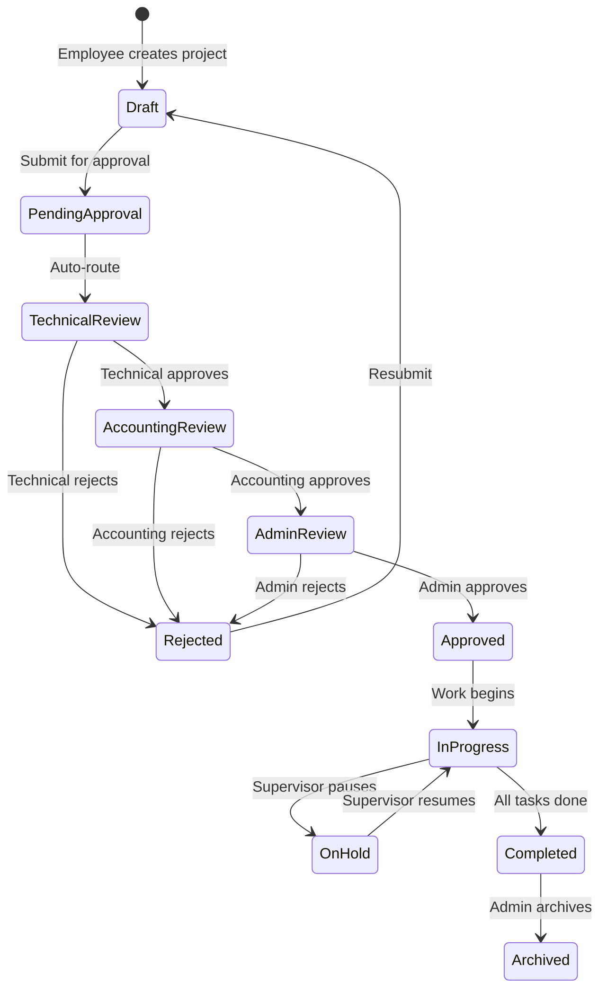
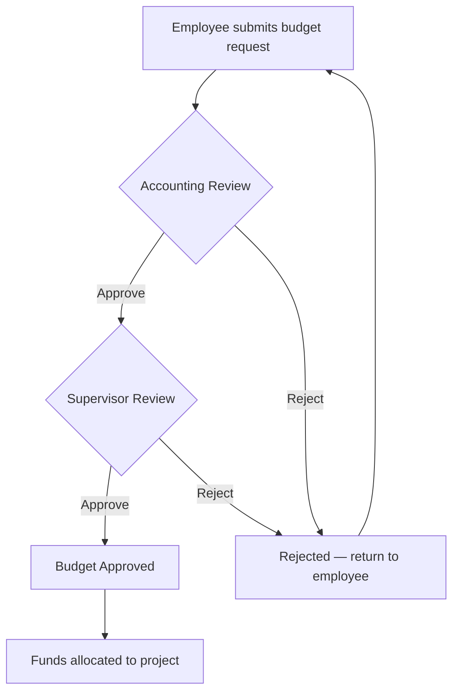
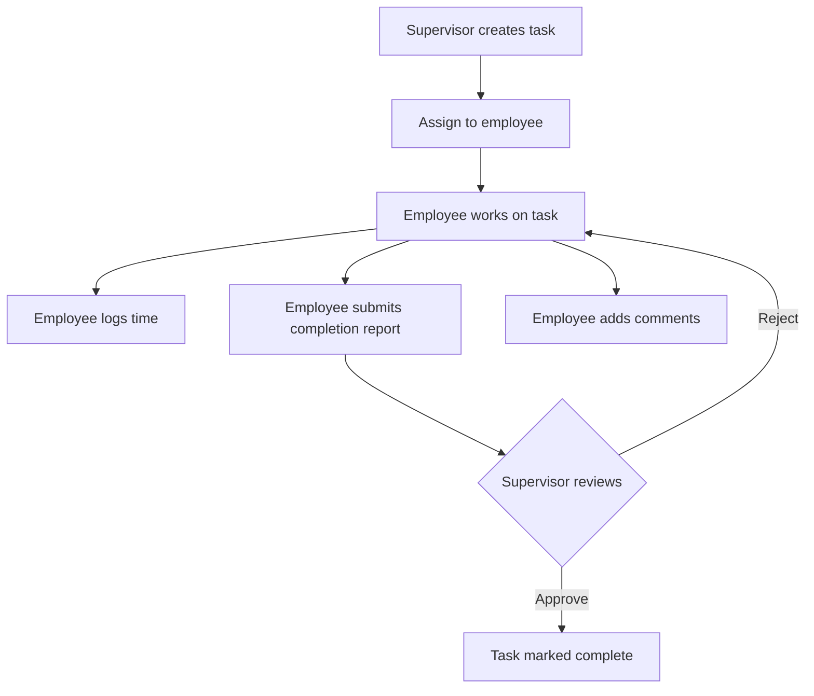

# Business Process Model

**Maptech Information Solutions Inc. — Project Management System v5.0**

---

## 1. Project Lifecycle

## 2. Approval Pipeline

The system enforces a **4-stage approval pipeline**:

| Stage | Approver | Criteria |
|-------|----------|----------|
| 1. Submission | Employee | Project form completed with all required fields |
| 2. Technical Review | Technical Supervisor | Technical feasibility, scope validation |
| 3. Accounting Review | Accounting Supervisor | Budget adequacy, financial viability |
| 4. Admin Approval | Admin (Superadmin) | Final authorization |

Each stage is logged in the audit trail with approver identity, timestamp, and optional remarks.

## 3. Budget Request Flow

## 4. Task Management Flow

## 5. Key Business Rules

### 5.1 Access Control
- **Employees** can only view/modify projects they are assigned to (via `team_ids`)
- **Supervisors** can manage projects in their department scope
- **Admins** have unrestricted access to all system functions

### 5.2 Data Integrity
- Audit logs are immutable — no updates or deletions permitted
- Deleted users are soft-removed (FK `nullOnDelete`) to preserve history
- Project status transitions are enforced (no skipping approval stages)

### 5.3 Notifications
Automated notifications are triggered for:
- Budget request approval/rejection
- Task review completion
- Task blockers reported
- Overdue task alerts (daily scheduled job)
- Project status changes

### 5.4 Sprint Workflow
1. Supervisor creates sprint with date range
2. Tasks are assigned to sprint
3. Team works through sprint backlog
4. Sprint completed when all tasks are done or date range ends

### 5.5 Template Workflow
1. Admin/Supervisor creates project template
2. Template captures project structure (tasks, phases, milestones)
3. New projects can be instantiated from template
4. Template data is copied and customized for the new project

---

*For detailed system flows with sequence diagrams, see [08-System-Flow.md](08-System-Flow.md).*
