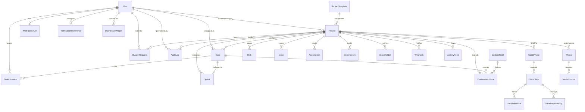

# Data Architecture

**Maptech Information Solutions Inc. — Project Management System v5.0**

---

## 1. Database Overview

- **Engine**: PostgreSQL 15+ (or MySQL 8+)
- **Migrations**: 67 total, all applied
- **Models**: 27 Eloquent models with relationships
- **Foreign Keys**: `nullOnDelete` pattern to preserve historical data

## 2. Core Entity-Relationship Diagram

## 3. Key Models

| Model | Table | Purpose |
|-------|-------|---------|
| User | users | System users with department/role |
| Project | projects | Project records with approval status |
| Task | tasks | Work items assigned to users |
| BudgetRequest | budget_requests | Financial requests per project |
| AuditLog | audit_logs | Immutable compliance trail |
| Media | media | Uploaded files with access control |
| MediaVersion | media_versions | File version history |
| GanttPhase | gantt_phases | Timeline phases |
| GanttStep | gantt_steps | Phase sub-items |
| GanttMilestone | gantt_milestones | Key dates/deliverables |
| GanttDependency | gantt_dependencies | Step-to-step relationships |
| Risk | risks | Project risk register |
| Issue | issues | Project issue tracker |
| Assumption | assumptions | Project assumptions |
| Dependency | dependencies | Project dependencies |
| Stakeholder | stakeholders | Project stakeholder records |
| TaskComment | task_comments | Threaded task discussions |
| Sprint | sprints | Iteration/sprint containers |
| CustomField | custom_fields | Field definitions |
| CustomFieldValue | custom_field_values | Field values per entity |
| ProjectTemplate | project_templates | Reusable project blueprints |
| Webhook | webhooks | External integration hooks |
| TwoFactorAuth | two_factor_auths | 2FA credentials |
| NotificationPreference | notification_preferences | User notification settings |
| DashboardWidget | dashboard_widgets | User dashboard configuration |
| ActivityFeed | activity_feeds | Project activity timeline |
| BudgetVariance | budget_variances | Budget vs. actual tracking |

## 4. Key Schema Patterns

### 4.1 JSON Columns
- `projects.team_ids` — Array of assigned user IDs
- `custom_field_values.value` — Polymorphic field storage
- `dashboard_widgets.preferences` — Widget configuration
- `webhooks.events` — Subscribed event types

### 4.2 Soft References
- Foreign keys use `nullOnDelete` to preserve records when referenced entities are removed
- `AuditLog` stores `user_id` and `user_name` for historical reference even after user deletion

### 4.3 Immutable Tables
- `audit_logs` — Model-level guards prevent update and delete operations
- Only insert operations are permitted on audit records

## 5. Migration Inventory

The system has 67 migrations covering:
- Core tables (users, projects, tasks, budget_requests)
- Gantt chart tables (phases, steps, milestones, dependencies)
- Issue tracking (risks, issues, assumptions, dependencies)
- Media management (media, media_versions)
- Task features (task_comments, sprints)
- Custom fields (custom_fields, custom_field_values)
- Administration (webhooks, two_factor_auths, notification_preferences, dashboard_widgets)
- Activity tracking (activity_feeds, audit_logs)
- Budget analysis (budget_variances)
- Project templates (project_templates)

---

*For complete schema details and column definitions, see [docs/SYSTEM_DOCUMENTATION.md](../docs/SYSTEM_DOCUMENTATION.md).*
